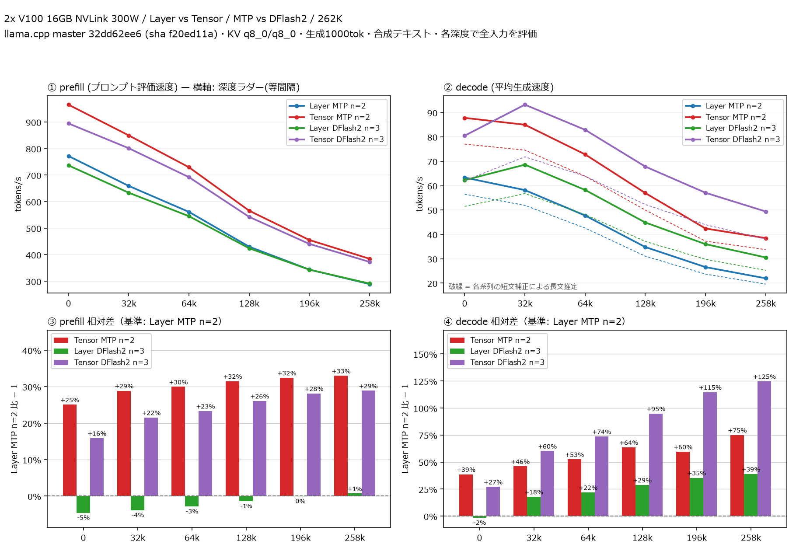

# V100 2枚で Qwen3.8 27B の Layer・Tensor分割と MTP・DFlash2 を比較

- **作成者**: pakutoma
- **作成日**: 2026-10-07

## 概要

Tesla V100-SXM2-16GB 2枚（NVLink、各300 W）で、Qwen3.8-27B UD-Q4_K_MのLayer/Tensor分割と内蔵MTP/DFlash2を262kコンテキストまで比較した。ドラフターの先読みtoken数nは標準3設問でn=1〜7を掃引し、結果が最も良かったMTPはn=2、DFlash2はn=3を両分割方式で採用した。
全深度でTensorがLayerより速く、最深段のdecodeはMTPが22.0 → 38.5 tok/s、DFlash2が30.5 → 49.4 tok/sだった。DFlash2のTensor分割はベンチマーク取得時点でllama.cppがサポートしていなかったため、添付の独自パッチを使用した。

## ハードウェア

| 項目 | 内容 |
|---|---|
| コンピュータ / マザーボード | ASRock B550M Pro RS |
| GPU | Tesla V100-SXM2-16GB × 2（各16,384 MiB、電力上限300 W） |
| GPU接続 | NVLink (300 GB/s)、PCIe Gen3 x8 / GPU |
| CPU | AMD Ryzen 5 5500GT（6コア12スレッド） |
| メモリ | DDR4-2400 64GB（16GB × 4） |

## ソフトウェア環境

| 項目 | 内容 |
|---|---|
| OS | Ubuntu 26.04.1 LTS、Linux 7.0.0-34-generic |
| GPUドライバ | NVIDIA 580.178.04 |
| ビルド | CUDA Toolkit 12.4.131、GNU C++ 13.4.0、Release、SM70 |
| llama.cpp | `32dd62ee6dfa80ada846551fefec215cefc5ae1c`（b11324）＋添付のDFlash2 Tensor対応パッチ |
| NCCL | 2.27.5 |
| ツール | llama-split-bench `7af72d4085aa5073677d41389144112dd94fcb74` |

## ベンチマーク

### 条件

| 項目 | 内容 |
|---|---|
| モデル | [unsloth](https://huggingface.co/unsloth/Qwen3.8-27B-GGUF) Qwen3.8-27B UD-Q4_K_M（15.334 GiB） |
| ドラフト | 内蔵MTP、または[inco.ai](https://huggingface.co/incoai/Qwen3.8-27B-DFlash2-GGUF) Qwen3.8-27B-DFlash2 Q4_K_M（1.065 GiB） |
| 測定モード | Layer / Tensor × MTP / DFlash2、CUDA0,CUDA1 |
| ctx / stages | 262144 / 0,32000,64000,128000,196000,258000 |
| KVキャッシュ | q8_0 / q8_0 |
| 投機設定 | MTP n=2、DFlash2 n=3（各方式でLayer/Tensor共通） |
| 通信 | `GGML_CUDA_ALLREDUCE=nccl`、`GGML_CUDA_P2P=1` |
| 配置比率 GPU0:GPU1 | Layerは36:28、Tensorは1:1。Layer DFlash2のドラフトはCUDA1、Tensorは両GPU |
| その他 | Flash Attention on、batch1024 / microbatch256、threads6、parallel1、seed42、各段1000 tokens生成、各1回 |

batch / microbatchはllama.cppの既定値2048 / 512から1024 / 256へ減らした。262kコンテキストでは既定値でTensor DFlash2のn=6・7がGPUメモリ不足になったため、コンテキスト長を維持して4条件とも同じ値に揃えた。

先読み数は4方式それぞれn=1〜7を標準3設問（design / review / qa、temperature0.7、top-p0.9、各最大1200 tokens、各リクエストseed42）で測り、方式別にLayer/Tensorを通じて平均decodeが最大となる先読み数を共通採用した。LayerとTensorそれぞれの最速も一致した。

### 結果

深度ごとのprefill / decode（tok/s）。LはLayer、TはTensor。深度0のprefillは新規入力PP2048の値。実線のdecodeは合成テキストでの実測値で、各段の入力全体を評価した（cache_n=0）。最大実入力は259,601 tokens。図の下段は左がprefill、右がdecodeで、それぞれ同じ深度のLayer MTP n=2に対する他3構成の相対差を、（比較対象の速度 ÷ 基準の速度 − 1）×100%で示す。

| depth | prefill L MTP n=2 | prefill T MTP n=2 | prefill L DFlash2 n=3 | prefill T DFlash2 n=3 | decode L MTP n=2 | decode T MTP n=2 | decode L DFlash2 n=3 | decode T DFlash2 n=3 |
|---:|---:|---:|---:|---:|---:|---:|---:|---:|
| 0 | 771.8 | 965.2 | 736.4 | 894.6 | 63.3 | 87.8 | 62.3 | 80.5 |
| 32k | 659.2 | 849.6 | 633.6 | 801.2 | 58.2 | 85.0 | 68.6 | 93.2 |
| 64k | 561.2 | 729.5 | 545.1 | 692.1 | 47.7 | 72.8 | 58.2 | 82.9 |
| 128k | 430.2 | 565.8 | 424.1 | 542.4 | 34.8 | 57.0 | 44.9 | 67.8 |
| 196k | 343.8 | 455.4 | 343.6 | 440.6 | 26.6 | 42.4 | 36.0 | 57.1 |
| 258k | 289.2 | 384.6 | 291.2 | 372.8 | 22.0 | 38.5 | 30.5 | 49.4 |

深度0の新規入力prefill（tok/s）。目標512 / 2048 / 8192に対する実入力は512 / 1978 / 8077 tokens。

| 目標長 | Layer MTP n=2 | Tensor MTP n=2 | Layer DFlash2 n=3 | Tensor DFlash2 n=3 |
|---:|---:|---:|---:|---:|
| 512 | 718.3 | 989.5 | 678.8 | 902.8 |
| 2048 | 771.8 | 965.2 | 736.4 | 894.6 |
| 8192 | 751.4 | 958.3 | 719.7 | 895.1 |

標準3設問の平均decodeは、Layer/Tensorの順にMTP n=2が56.50 / 77.05 tok/s、DFlash2 n=3が51.49 / 62.03 tok/sだった。各系列の3設問平均を同系列の合成テキスト深度0 decodeで割り、係数0.892209 / 0.877448 / 0.826929 / 0.770442（Layer MTP n=2 / Tensor MTP n=2 / Layer DFlash2 n=3 / Tensor DFlash2 n=3）を算出した。各深度の実測decodeにこの固有係数を掛けた値を破線で示す。破線は短文から長文への推定であり、長文の実プロンプト測定ではない。

### 所感

- 全深度でTensorのdecodeがLayerより速く、MTP n=2では+38.7〜75.1%、DFlash2 n=3では+29.3〜61.7%だった。
- 標準3設問ではMTP n=2が速かった。一方、合成テキストでは32K以降でDFlash2 n=3がMTP n=2を上回った。

- DFlash2の平均採用長は、Layerと比べてTensorで短い傾向がみられる。より平均採用長が伸びやすいHumanEvalのコード生成を用いてn=7で比較した場合でも、Layerの3.806からTensorの3.743へ低下がみられた。原因の一つとして、GPU間通信のBF16圧縮がある。HumanEvalの場合では、Tensorの通信を標準NCCLからFP32へ変更すると平均採用長が3.853へ増えた。
- DFlash2ではTensor分割によるドラフト生成の高速化が得られなかった。n=7で詳細な処理時間を取ったところ、MTPではLayer 15.44msに対してTensor 11.31 ms、DFlash2ではLayer 8.92msに対してTensor 9.40 msとなり、DFlash2はTensor分割で投機パスのdecode速度が悪化している。これは分散時のグラフ割当や再構築についてllama.cpp実装上の最適化の余地があると思われる。
- 合成テキストの長文測定はDFlash2に非常に有利だった。Tensor DFlash2 n=7でも32k段で134.1 tok/s、258k段で71.0 tok/sを記録し、32k段のドラフト受理率は99.8%だった。

## 参考

### 先読み数の掃引

主比較と同じ条件で測定した標準3設問の結果。decodeは各設問の速度の算術平均。平均採用長（Acceptance Length）は[DFlash2公式](https://huggingface.co/incoai/Qwen3.8-27B-DFlash2#acceptance-length)と同じく、各設問の「生成token数 ÷ 検証回数」を求めてから算術平均した。単位はtokens/検証で、ドラフトの採択数だけを数えた百分率の受理率とは異なる。検証回数は保存済みサーバーログの累積accept呼び出し回数の差分から取得し、ウォームアップを除外した。

| 先読み数n | Layer MTP decode | Layer MTP 採用長 | Tensor MTP decode | Tensor MTP 採用長 | Layer DFlash2 decode | Layer DFlash2 採用長 | Tensor DFlash2 decode | Tensor DFlash2 採用長 |
|---:|---:|---:|---:|---:|---:|---:|---:|---:|
| n=1 | 51.40 | 1.759 | 70.56 | 1.749 | 45.07 | 1.715 | 52.60 | 1.675 |
| n=2 | 56.50 | 2.283 | 77.05 | 2.243 | 51.23 | 2.172 | 59.94 | 2.091 |
| n=3 | 54.74 | 2.580 | 75.77 | 2.513 | 51.49 | 2.459 | 62.03 | 2.349 |
| n=4 | 50.08 | 2.678 | 72.38 | 2.706 | 47.41 | 2.490 | 61.76 | 2.525 |
| n=5 | 47.44 | 2.896 | 64.29 | 2.723 | 46.64 | 2.735 | 55.99 | 2.515 |
| n=6 | 39.98 | 2.780 | 60.43 | 2.939 | 40.83 | 2.677 | 53.53 | 2.673 |
| n=7 | 40.42 | 2.985 | 57.20 | 2.946 | 41.36 | 2.785 | 54.05 | 2.770 |

decodeの単位はtok/s。Layerの主モデル配置（GPU0:GPU1）は、MTP n=1が37:27、MTP n=2・3とDFlash2 n=1〜3が36:28、両方式のn=4〜7が35:29。Tensorは全設定1:1。

## 添付

- [run-info.json](attachment/2026-10-07_073209_comparing_layer_and_tensor_mtp_and_dflash2_on_2x_v100/run-info.json)
- [split-bench-en.png](attachment/2026-10-07_073209_comparing_layer_and_tensor_mtp_and_dflash2_on_2x_v100/split-bench-en.png)
- [dflash2-tensor.patch](attachment/2026-10-07_073209_comparing_layer_and_tensor_mtp_and_dflash2_on_2x_v100/dflash2-tensor.patch)
- Layer MTP n=2: [ladder](attachment/2026-10-07_073209_comparing_layer_and_tensor_mtp_and_dflash2_on_2x_v100/results-layer-mtp2.json) / [PP0](attachment/2026-10-07_073209_comparing_layer_and_tensor_mtp_and_dflash2_on_2x_v100/results-layer-mtp2-pp0.json) / [標準3設問](attachment/2026-10-07_073209_comparing_layer_and_tensor_mtp_and_dflash2_on_2x_v100/results-real-layer-mtp2.json) / [起動引数](attachment/2026-10-07_073209_comparing_layer_and_tensor_mtp_and_dflash2_on_2x_v100/argv-layer-mtp2.txt)
- Tensor MTP n=2: [ladder](attachment/2026-10-07_073209_comparing_layer_and_tensor_mtp_and_dflash2_on_2x_v100/results-tensor-mtp2.json) / [PP0](attachment/2026-10-07_073209_comparing_layer_and_tensor_mtp_and_dflash2_on_2x_v100/results-tensor-mtp2-pp0.json) / [標準3設問](attachment/2026-10-07_073209_comparing_layer_and_tensor_mtp_and_dflash2_on_2x_v100/results-real-tensor-mtp2.json) / [起動引数](attachment/2026-10-07_073209_comparing_layer_and_tensor_mtp_and_dflash2_on_2x_v100/argv-tensor-mtp2.txt)
- Layer DFlash2 n=3: [ladder](attachment/2026-10-07_073209_comparing_layer_and_tensor_mtp_and_dflash2_on_2x_v100/results-layer-dflash3.json) / [PP0](attachment/2026-10-07_073209_comparing_layer_and_tensor_mtp_and_dflash2_on_2x_v100/results-layer-dflash3-pp0.json) / [標準3設問](attachment/2026-10-07_073209_comparing_layer_and_tensor_mtp_and_dflash2_on_2x_v100/results-real-layer-dflash3.json) / [起動引数](attachment/2026-10-07_073209_comparing_layer_and_tensor_mtp_and_dflash2_on_2x_v100/argv-layer-dflash3.txt)
- Tensor DFlash2 n=3: [ladder](attachment/2026-10-07_073209_comparing_layer_and_tensor_mtp_and_dflash2_on_2x_v100/results-tensor-dflash3.json) / [PP0](attachment/2026-10-07_073209_comparing_layer_and_tensor_mtp_and_dflash2_on_2x_v100/results-tensor-dflash3-pp0.json) / [標準3設問](attachment/2026-10-07_073209_comparing_layer_and_tensor_mtp_and_dflash2_on_2x_v100/results-real-tensor-dflash3.json) / [起動引数](attachment/2026-10-07_073209_comparing_layer_and_tensor_mtp_and_dflash2_on_2x_v100/argv-tensor-dflash3.txt)
